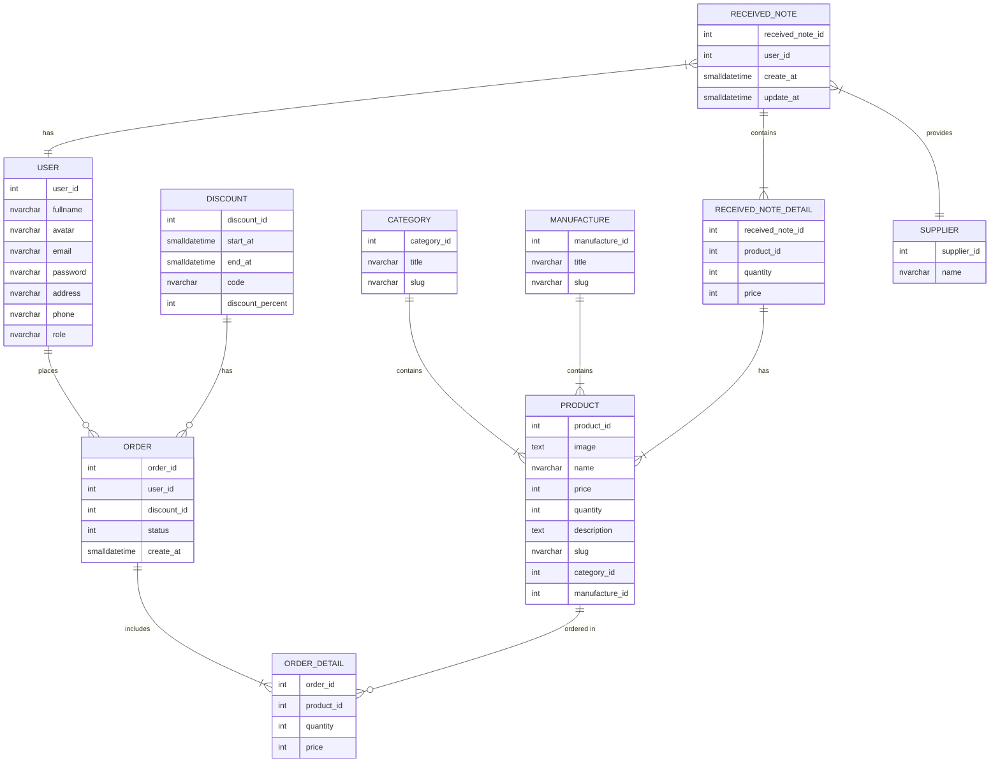

### DB Structure ###



----
### How to run ###
**Start MS SQL server from docker compose**
```
docker-compose up -d
```
> Using any SQL client to import sql file : BlazorEC.sql

**Start Application**
```
cd BlazorAppEC/Server && dotnet watch run
```
-----
### Connection String ###
```
Data Source=localhost,1433;Initial Catalog=BlazorEC;User ID=SA;Password=Tuan2903
-----
server=localhost,1433; database=BlazorEC;User ID=sa; Password=Tuan2903;Trusted_Connection=False;
```

### Scaffold Command For EF ###

```
dotnet ef dbcontext scaffold -o Models -f -d "Data Source=localhost,1433;Initial Catalog=BlazorEC;User ID=SA;Password=Tuan2903" "Microsoft.EntityFrameworkCore.SqlServer"
```
